# PictureStory クラス図

## 目次
1. [全体構造概要](#1-全体構造概要)
2. [コアシステム層](#2-コアシステム層)
3. [ステータスデータ層](#3-ステータスデータ層)
4. [スキルシステム層](#4-スキルシステム層)
5. [アイテムシステム層](#5-アイテムシステム層)
6. [戦闘システム層](#6-戦闘システム層)
   - 6.3 [状態異常システム](#63-状態異常システム)
   - 6.4 [武器タイプシステム](#64-武器タイプシステム)
7. [入力システム層](#7-入力システム層)
8. [依存関係サマリー](#8-依存関係サマリー)
9. [AIシステム層](#9-aiシステム層)
10. [クエストシステム層](#10-クエストシステム層)
11. [パートナーシステム層](#11-パートナーシステム層)

---

## 1. 全体構造概要

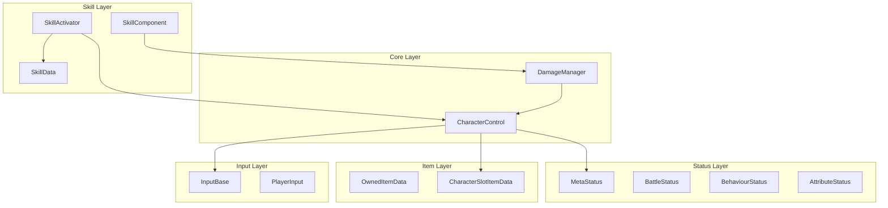
```mermaid
graph TB
    subgraph "Core Layer"
        CC[CharacterControl]
        DM[DamageManager]
    end

    subgraph "Status Layer"
        MS[MetaStatus]
        BS[BattleStatus]
        BHS[BehaviourStatus]
        AS[AttributeStatus]
    end

    subgraph "Skill Layer"
        SD[SkillData]
        SC[SkillComponent]
        SA[SkillActivator]
    end

    subgraph "Item Layer"
        OID[OwnedItemData]
        CSID[CharacterSlotItemData]
    end

    subgraph "Input Layer"
        IB[InputBase]
        PI[PlayerInput]
    end

    CC --> MS
    CC --> CSID
    CC --> IB
    SA --> CC
    SA --> SD
    SC --> DM
    DM --> CC
```

---

## 2. コアシステム層

### 2.1 CharacterControl クラス図

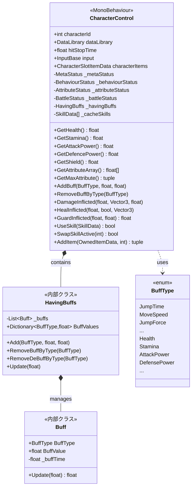
```mermaid
classDiagram
    class CharacterControl {
        <<MonoBehaviour>>
        +int characterId
        +DataLibrary dataLibrary
        +float hitStopTime
        +InputBase input
        +CharacterSlotItemData characterItems

        -MetaStatus _metaStatus
        -BehaviourStatus _behaviourStatus
        -AttributeStatus _attributeStatus
        -BattleStatus _battleStatus
        -HavingBuffs _havingBuffs
        -SkillData[] _cacheSkills

        +GetHealth() float
        +GetStamina() float
        +GetAttackPower() float
        +GetDefencePower() float
        +GetShield() float
        +GetAttributeArray() float[]
        +GetMaxAttribute() tuple

        +AddBuff(BuffType, float, float)
        +RemoveBuffByType(BuffType)
        +DamageInflicted(float, Vector3, float)
        +HealInflicted(float, bool, Vector3)
        +GuardInflicted(float, float) float
        +UseSkill(SkillData) bool
        +SwapSkillActive(int) bool
        +AddItem(OwnedItemData, int) tuple
    }

    class HavingBuffs {
        <<内部クラス>>
        -List~Buff~ _buffs
        +Dictionary~BuffType,float~ BuffValues
        +Add(BuffType, float, float)
        +RemoveBuffByType(BuffType)
        +RemoveDeBuffByType(BuffType)
        +Update(float)
    }

    class Buff {
        <<内部クラス>>
        +BuffType BuffType
        +float BuffValue
        -float _buffTime
        +Update(float) float
    }

    class BuffType {
        <<enum>>
        JumpTime
        MoveSpeed
        JumpForce
        ...
        Health
        Stamina
        AttackPower
        DefensePower
        ...
    }

    CharacterControl *-- HavingBuffs : contains
    HavingBuffs *-- Buff : manages
    CharacterControl ..> BuffType : uses
```

### 2.2 CharacterControl と関連クラス

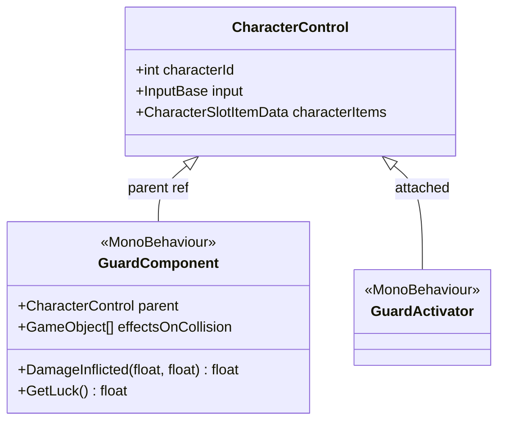
```mermaid
classDiagram
    class CharacterControl {
        +int characterId
        +InputBase input
        +CharacterSlotItemData characterItems
    }

    class GuardComponent {
        <<MonoBehaviour>>
        +CharacterControl parent
        +GameObject[] effectsOnCollision
        +DamageInflicted(float, float) float
        +GetLuck() float
    }

    class GuardActivator {
        <<MonoBehaviour>>
    }

    CharacterControl <|-- GuardComponent : parent ref
    CharacterControl <|-- GuardActivator : attached
```

---

## 3. ステータスデータ層

### 3.1 ステータスクラス継承図

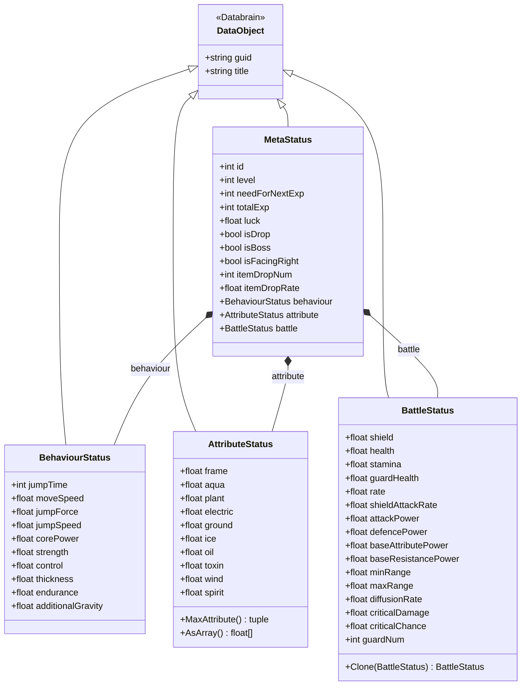
```mermaid
classDiagram
    class DataObject {
        <<Databrain>>
        +string guid
        +string title
    }

    class MetaStatus {
        +int id
        +int level
        +int needForNextExp
        +int totalExp
        +float luck
        +bool isDrop
        +bool isBoss
        +bool isFacingRight
        +int itemDropNum
        +float itemDropRate
        +BehaviourStatus behaviour
        +AttributeStatus attribute
        +BattleStatus battle
    }

    class BehaviourStatus {
        +int jumpTime
        +float moveSpeed
        +float jumpForce
        +float jumpSpeed
        +float corePower
        +float strength
        +float control
        +float thickness
        +float endurance
        +float additionalGravity
    }

    class AttributeStatus {
        +float frame
        +float aqua
        +float plant
        +float electric
        +float ground
        +float ice
        +float oil
        +float toxin
        +float wind
        +float spirit
        +MaxAttribute() tuple
        +AsArray() float[]
    }

    class BattleStatus {
        +float shield
        +float health
        +float stamina
        +float guardHealth
        +float rate
        +float shieldAttackRate
        +float attackPower
        +float defencePower
        +float baseAttributePower
        +float baseResistancePower
        +float minRange
        +float maxRange
        +float diffusionRate
        +float criticalDamage
        +float criticalChance
        +int guardNum
        +Clone(BattleStatus) BattleStatus
    }

    DataObject <|-- MetaStatus
    DataObject <|-- BehaviourStatus
    DataObject <|-- AttributeStatus
    DataObject <|-- BattleStatus

    MetaStatus *-- BehaviourStatus : behaviour
    MetaStatus *-- AttributeStatus : attribute
    MetaStatus *-- BattleStatus : battle
```

### 3.2 StatusLibrary

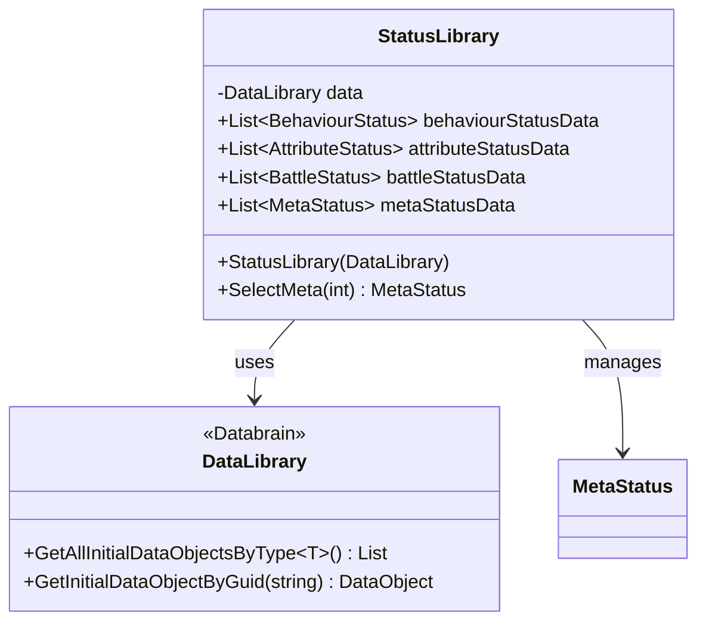
```mermaid
classDiagram
    class StatusLibrary {
        -DataLibrary data
        +List~BehaviourStatus~ behaviourStatusData
        +List~AttributeStatus~ attributeStatusData
        +List~BattleStatus~ battleStatusData
        +List~MetaStatus~ metaStatusData
        +StatusLibrary(DataLibrary)
        +SelectMeta(int) MetaStatus
    }

    class DataLibrary {
        <<Databrain>>
        +GetAllInitialDataObjectsByType~T~() List
        +GetInitialDataObjectByGuid(string) DataObject
    }

    StatusLibrary --> DataLibrary : uses
    StatusLibrary --> MetaStatus : manages
```

---

## 4. スキルシステム層

### 4.1 スキルデータ継承図

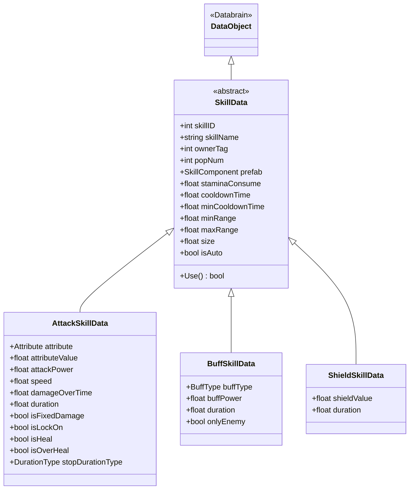
```mermaid
classDiagram
    class DataObject {
        <<Databrain>>
    }

    class SkillData {
        <<abstract>>
        +int skillID
        +string skillName
        +int ownerTag
        +int popNum
        +SkillComponent prefab
        +float staminaConsume
        +float cooldownTime
        +float minCooldownTime
        +float minRange
        +float maxRange
        +float size
        +bool isAuto
        +Use() bool
    }

    class AttackSkillData {
        +Attribute attribute
        +float attributeValue
        +float attackPower
        +float speed
        +float damageOverTime
        +float duration
        +bool isFixedDamage
        +bool isLockOn
        +bool isHeal
        +bool isOverHeal
        +DurationType stopDurationType
    }

    class BuffSkillData {
        +BuffType buffType
        +float buffPower
        +float duration
        +bool onlyEnemy
    }

    class ShieldSkillData {
        +float shieldValue
        +float duration
    }

    DataObject <|-- SkillData
    SkillData <|-- AttackSkillData
    SkillData <|-- BuffSkillData
    SkillData <|-- ShieldSkillData
```

### 4.2 スキルコンポーネント

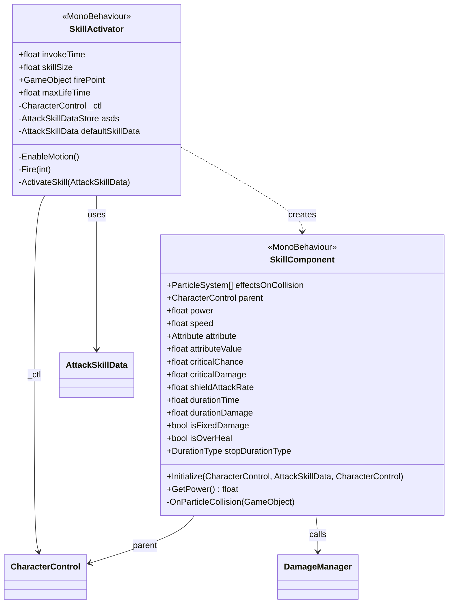
```mermaid
classDiagram
    class SkillComponent {
        <<MonoBehaviour>>
        +ParticleSystem[] effectsOnCollision
        +CharacterControl parent
        +float power
        +float speed
        +Attribute attribute
        +float attributeValue
        +float criticalChance
        +float criticalDamage
        +float shieldAttackRate
        +float durationTime
        +float durationDamage
        +bool isFixedDamage
        +bool isOverHeal
        +DurationType stopDurationType

        +Initialize(CharacterControl, AttackSkillData, CharacterControl)
        +GetPower() float
        -OnParticleCollision(GameObject)
    }

    class SkillActivator {
        <<MonoBehaviour>>
        +float invokeTime
        +float skillSize
        +GameObject firePoint
        +float maxLifeTime
        -CharacterControl _ctl
        -AttackSkillDataStore asds
        -AttackSkillData defaultSkillData

        -EnableMotion()
        -Fire(int)
        -ActivateSkill(AttackSkillData)
    }

    SkillActivator --> CharacterControl : _ctl
    SkillActivator --> AttackSkillData : uses
    SkillActivator ..> SkillComponent : creates
    SkillComponent --> CharacterControl : parent
    SkillComponent --> DamageManager : calls
```

---

## 5. アイテムシステム層

### 5.1 アイテムデータ継承図

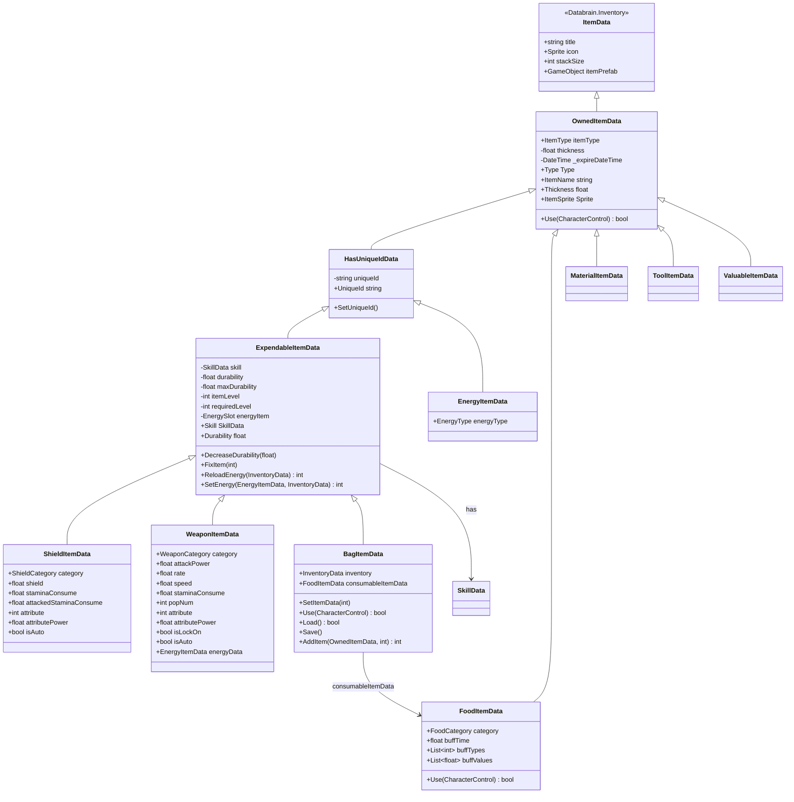
```mermaid
classDiagram
    class ItemData {
        <<Databrain.Inventory>>
        +string title
        +Sprite icon
        +int stackSize
        +GameObject itemPrefab
    }

    class OwnedItemData {
        +ItemType itemType
        -float thickness
        -DateTime _expireDateTime
        +Type Type
        +ItemName string
        +Thickness float
        +ItemSprite Sprite
        +Use(CharacterControl) bool
    }

    class HasUniqueIdData {
        -string uniqueId
        +UniqueId string
        +SetUniqueId()
    }

    class ExpendableItemData {
        -SkillData skill
        -float durability
        -float maxDurability
        -int itemLevel
        -int requiredLevel
        -EnergySlot energyItem
        +Skill SkillData
        +Durability float
        +DecreaseDurability(float)
        +FixItem(int)
        +ReloadEnergy(InventoryData) int
        +SetEnergy(EnergyItemData, InventoryData) int
    }

    class ShieldItemData {
        +ShieldCategory category
        +float shield
        +float staminaConsume
        +float attackedStaminaConsume
        +int attribute
        +float attributePower
        +bool isAuto
    }

    class WeaponItemData {
        +WeaponCategory category
        +float attackPower
        +float rate
        +float speed
        +float staminaConsume
        +int popNum
        +int attribute
        +float attributePower
        +bool isLockOn
        +bool isAuto
        +EnergyItemData energyData
    }

    class BagItemData {
        +InventoryData inventory
        +FoodItemData consumableItemData
        +SetItemData(int)
        +Use(CharacterControl) bool
        +Load() bool
        +Save()
        +AddItem(OwnedItemData, int) int
    }

    class FoodItemData {
        +FoodCategory category
        +float buffTime
        +List~int~ buffTypes
        +List~float~ buffValues
        +Use(CharacterControl) bool
    }

    class MaterialItemData {
    }

    class ToolItemData {
    }

    class ValuableItemData {
    }

    class EnergyItemData {
        +EnergyType energyType
    }

    ItemData <|-- OwnedItemData
    OwnedItemData <|-- HasUniqueIdData
    OwnedItemData <|-- FoodItemData
    OwnedItemData <|-- MaterialItemData
    OwnedItemData <|-- ToolItemData
    OwnedItemData <|-- ValuableItemData
    HasUniqueIdData <|-- ExpendableItemData
    HasUniqueIdData <|-- EnergyItemData
    ExpendableItemData <|-- ShieldItemData
    ExpendableItemData <|-- WeaponItemData
    ExpendableItemData <|-- BagItemData

    ExpendableItemData --> SkillData : has
    BagItemData --> FoodItemData : consumableItemData
```

### 5.2 インベントリシステム

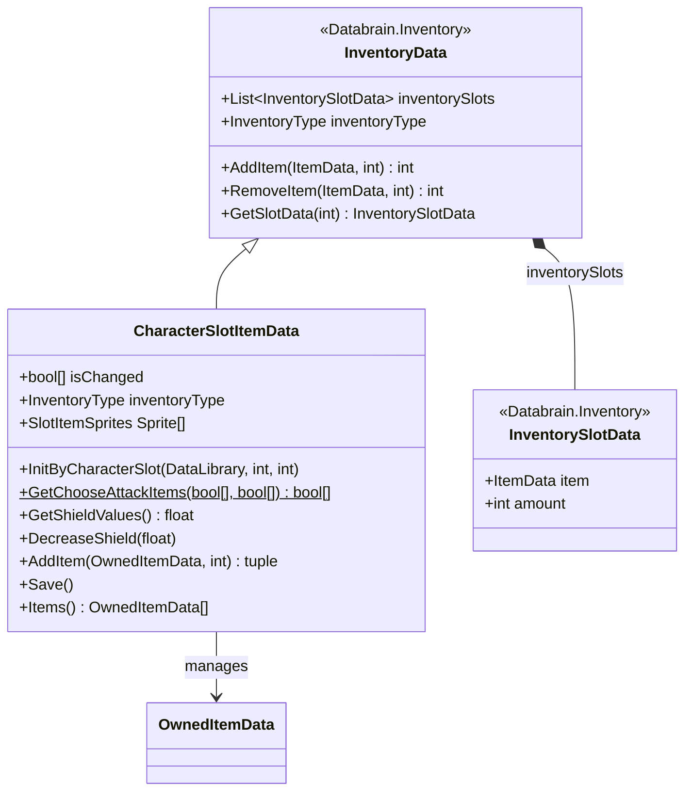
```mermaid
classDiagram
    class InventoryData {
        <<Databrain.Inventory>>
        +List~InventorySlotData~ inventorySlots
        +InventoryType inventoryType
        +AddItem(ItemData, int) int
        +RemoveItem(ItemData, int) int
        +GetSlotData(int) InventorySlotData
    }

    class CharacterSlotItemData {
        +bool[] isChanged
        +InventoryType inventoryType
        +InitByCharacterSlot(DataLibrary, int, int)
        +GetChooseAttackItems(bool[], bool[])$ bool[]
        +GetShieldValues() float
        +DecreaseShield(float)
        +AddItem(OwnedItemData, int) tuple
        +Save()
        +SlotItemSprites Sprite[]
        +Items() OwnedItemData[]
    }

    class InventorySlotData {
        <<Databrain.Inventory>>
        +ItemData item
        +int amount
    }

    InventoryData <|-- CharacterSlotItemData
    InventoryData *-- InventorySlotData : inventorySlots
    CharacterSlotItemData --> OwnedItemData : manages
```

### 5.3 アイテムドロップシステム

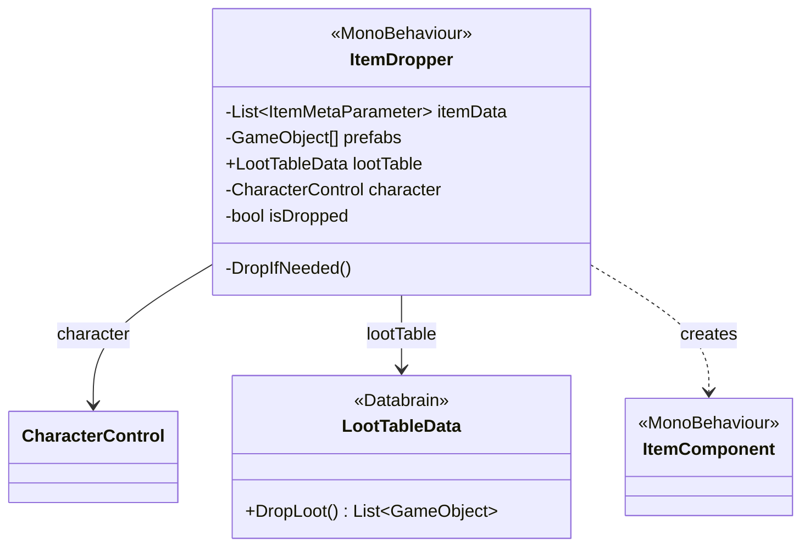
```mermaid
classDiagram
    class ItemDropper {
        <<MonoBehaviour>>
        -List~ItemMetaParameter~ itemData
        -GameObject[] prefabs
        +LootTableData lootTable
        -CharacterControl character
        -bool isDropped
        -DropIfNeeded()
    }

    class ItemComponent {
        <<MonoBehaviour>>
    }

    class LootTableData {
        <<Databrain>>
        +DropLoot() List~GameObject~
    }

    ItemDropper --> CharacterControl : character
    ItemDropper --> LootTableData : lootTable
    ItemDropper ..> ItemComponent : creates
```

---

## 6. 戦闘システム層

### 6.1 DamageManager

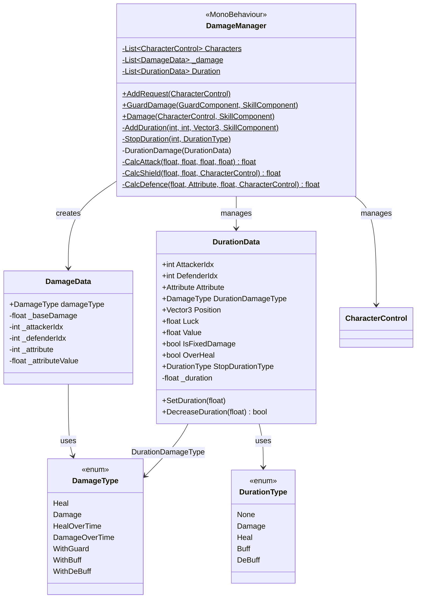
```mermaid
classDiagram
    class DamageManager {
        <<MonoBehaviour>>
        -List~CharacterControl~ Characters$
        -List~DamageData~ _damage$
        -List~DurationData~ Duration$

        +AddRequest(CharacterControl)$
        +GuardDamage(GuardComponent, SkillComponent)$
        +Damage(CharacterControl, SkillComponent)$
        -AddDuration(int, int, Vector3, SkillComponent)$
        -StopDuration(int, DurationType)$
        -DurationDamage(DurationData)
        -CalcAttack(float, float, float, float)$ float
        -CalcShield(float, float, CharacterControl)$ float
        -CalcDefence(float, Attribute, float, CharacterControl)$ float
    }

    class DamageData {
        +DamageType damageType
        -float _baseDamage
        -int _attackerIdx
        -int _defenderIdx
        -int _attribute
        -float _attributeValue
    }

    class DamageType {
        <<enum>>
        Heal
        Damage
        HealOverTime
        DamageOverTime
        WithGuard
        WithBuff
        WithDeBuff
    }

    class DurationData {
        +int AttackerIdx
        +int DefenderIdx
        +Attribute Attribute
        +DamageType DurationDamageType
        +Vector3 Position
        +float Luck
        +float Value
        +bool IsFixedDamage
        +bool OverHeal
        +DurationType StopDurationType
        -float _duration
        +SetDuration(float)
        +DecreaseDuration(float) bool
    }

    class DurationType {
        <<enum>>
        None
        Damage
        Heal
        Buff
        DeBuff
    }

    DamageManager --> CharacterControl : manages
    DamageManager --> DamageData : creates
    DamageManager --> DurationData : manages
    DamageData --> DamageType : uses
    DurationData --> DurationType : uses
    DurationData --> DamageType : DurationDamageType
```

### 6.2 属性システム

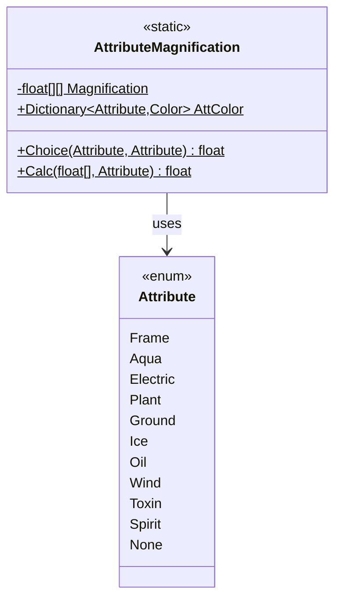
```mermaid
classDiagram
    class AttributeMagnification {
        <<static>>
        -float[][] Magnification$
        +Dictionary~Attribute,Color~ AttColor$
        +Choice(Attribute, Attribute)$ float
        +Calc(float[], Attribute)$ float
    }

    class Attribute {
        <<enum>>
        Frame
        Aqua
        Electric
        Plant
        Ground
        Ice
        Oil
        Wind
        Toxin
        Spirit
        None
    }

    AttributeMagnification --> Attribute : uses
```

### 6.3 状態異常システム

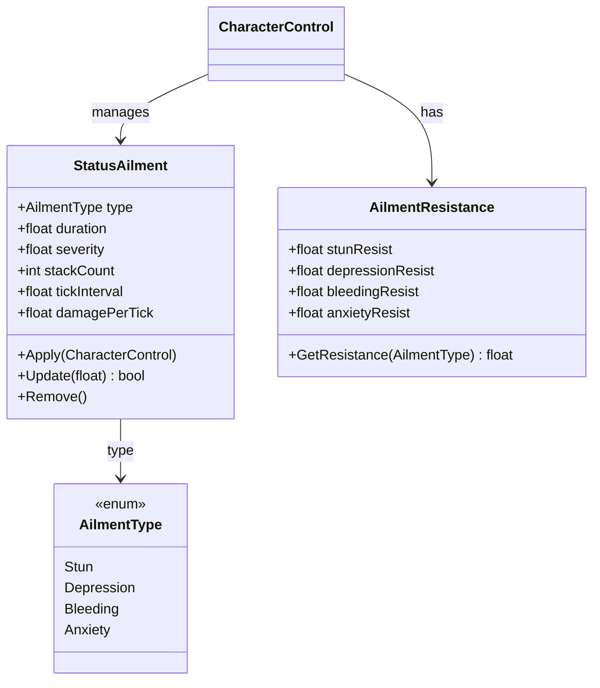
```mermaid
classDiagram
    class StatusAilment {
        +AilmentType type
        +float duration
        +float severity
        +int stackCount
        +float tickInterval
        +float damagePerTick
        +Apply(CharacterControl)
        +Update(float) bool
        +Remove()
    }

    class AilmentType {
        <<enum>>
        Stun
        Depression
        Bleeding
        Anxiety
    }

    class AilmentResistance {
        +float stunResist
        +float depressionResist
        +float bleedingResist
        +float anxietyResist
        +GetResistance(AilmentType) float
    }

    StatusAilment --> AilmentType : type
    CharacterControl --> StatusAilment : manages
    CharacterControl --> AilmentResistance : has
```

### 6.4 武器タイプシステム

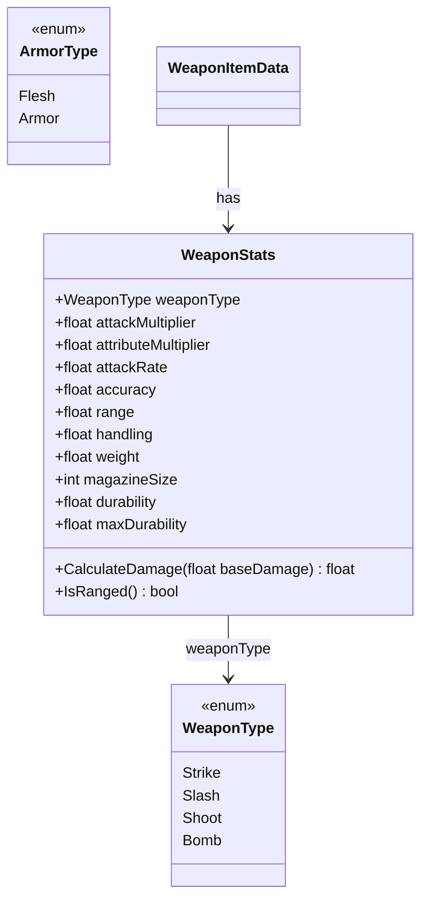
```mermaid
classDiagram
    class WeaponStats {
        +WeaponType weaponType
        +float attackMultiplier
        +float attributeMultiplier
        +float attackRate
        +float accuracy
        +float range
        +float handling
        +float weight
        +int magazineSize
        +float durability
        +float maxDurability
        +CalculateDamage(float baseDamage) float
        +IsRanged() bool
    }

    class WeaponType {
        <<enum>>
        Strike
        Slash
        Shoot
        Bomb
    }

    class ArmorType {
        <<enum>>
        Flesh
        Armor
    }

    WeaponStats --> WeaponType : weaponType
    WeaponItemData --> WeaponStats : has
```

---

## 7. 入力システム層

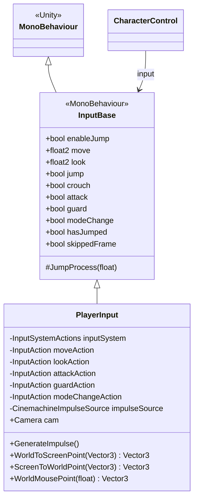
```mermaid
classDiagram
    class MonoBehaviour {
        <<Unity>>
    }

    class InputBase {
        <<MonoBehaviour>>
        +bool enableJump
        +float2 move
        +float2 look
        +bool jump
        +bool crouch
        +bool attack
        +bool guard
        +bool modeChange
        +bool hasJumped
        +bool skippedFrame
        #JumpProcess(float)
    }

    class PlayerInput {
        -InputSystemActions inputSystem
        -InputAction moveAction
        -InputAction lookAction
        -InputAction attackAction
        -InputAction guardAction
        -InputAction modeChangeAction
        -CinemachineImpulseSource impulseSource
        +Camera cam
        +GenerateImpulse()
        +WorldToScreenPoint(Vector3) Vector3
        +ScreenToWorldPoint(Vector3) Vector3
        +WorldMousePoint(float) Vector3
    }

    MonoBehaviour <|-- InputBase
    InputBase <|-- PlayerInput
    CharacterControl --> InputBase : input
```

---

## 8. 依存関係サマリー

### 8.1 クラス間の関係性一覧

| From | To | 関係 | 説明 |
|------|-----|------|------|
| CharacterControl | MetaStatus | 集約 | キャラクターのメタ情報 |
| CharacterControl | BehaviourStatus | 集約 | 行動パラメータ |
| CharacterControl | AttributeStatus | 集約 | 属性値 |
| CharacterControl | BattleStatus | 集約 | 戦闘パラメータ |
| CharacterControl | HavingBuffs | コンポジション | バフ管理(内部クラス) |
| CharacterControl | CharacterSlotItemData | 集約 | インベントリ |
| CharacterControl | InputBase | 集約 | 入力処理 |
| MetaStatus | BehaviourStatus | コンポジション | 行動ステータス参照 |
| MetaStatus | AttributeStatus | コンポジション | 属性ステータス参照 |
| MetaStatus | BattleStatus | コンポジション | 戦闘ステータス参照 |
| SkillActivator | CharacterControl | 依存 | スキル発動元 |
| SkillActivator | AttackSkillData | 依存 | スキルデータ参照 |
| SkillActivator | SkillComponent | 生成 | スキルエフェクト生成 |
| SkillComponent | CharacterControl | 依存 | 発動者参照 |
| SkillComponent | DamageManager | 依存 | ダメージ処理委譲 |
| DamageManager | CharacterControl | 管理 | キャラクターリスト管理 |
| DamageManager | SkillComponent | 依存 | スキル情報取得 |
| DamageManager | GuardComponent | 依存 | ガード処理 |
| GuardComponent | CharacterControl | 依存 | 親キャラクター参照 |
| ItemDropper | CharacterControl | 依存 | ドロップ判定 |
| ExpendableItemData | SkillData | 集約 | スキル付きアイテム |
| CharacterSlotItemData | OwnedItemData | 管理 | アイテム管理 |
| PlayerInput | InputBase | 継承 | 入力処理の具象クラス |

### 8.2 パッケージ/名前空間の依存

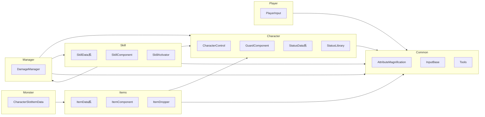
```mermaid
graph LR
    subgraph "Character"
        CC[CharacterControl]
        GC[GuardComponent]
        SD_C[StatusData系]
        SL[StatusLibrary]
    end

    subgraph "Skill"
        SD_S[SkillData系]
        SC[SkillComponent]
        SA[SkillActivator]
    end

    subgraph "Items"
        ID[ItemData系]
        IC[ItemComponent]
        IDR[ItemDropper]
    end

    subgraph "Manager"
        DM[DamageManager]
    end

    subgraph "Common"
        AM[AttributeMagnification]
        IB[InputBase]
        T[Tools]
    end

    subgraph "Player"
        PI[PlayerInput]
    end

    subgraph "Monster"
        CSID[CharacterSlotItemData]
    end

    Character --> Common
    Skill --> Character
    Skill --> Manager
    Skill --> Common
    Items --> Character
    Items --> Common
    Manager --> Character
    Manager --> Skill
    Manager --> Common
    Player --> Common
    Monster --> Items
```

---

## 9. AIシステム層

### 9.1 敵AIクラス図

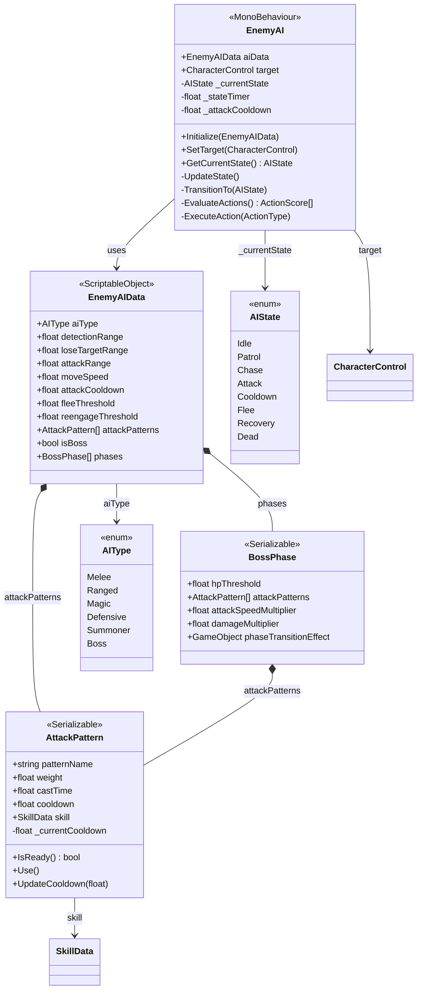
```mermaid
classDiagram
    class EnemyAI {
        <<MonoBehaviour>>
        +EnemyAIData aiData
        +CharacterControl target
        -AIState _currentState
        -float _stateTimer
        -float _attackCooldown

        +Initialize(EnemyAIData)
        +SetTarget(CharacterControl)
        +GetCurrentState() AIState
        -UpdateState()
        -TransitionTo(AIState)
        -EvaluateActions() ActionScore[]
        -ExecuteAction(ActionType)
    }

    class EnemyAIData {
        <<ScriptableObject>>
        +AIType aiType
        +float detectionRange
        +float loseTargetRange
        +float attackRange
        +float moveSpeed
        +float attackCooldown
        +float fleeThreshold
        +float reengageThreshold
        +AttackPattern[] attackPatterns
        +bool isBoss
        +BossPhase[] phases
    }

    class AttackPattern {
        <<Serializable>>
        +string patternName
        +float weight
        +float castTime
        +float cooldown
        +SkillData skill
        -float _currentCooldown
        +IsReady() bool
        +Use()
        +UpdateCooldown(float)
    }

    class BossPhase {
        <<Serializable>>
        +float hpThreshold
        +AttackPattern[] attackPatterns
        +float attackSpeedMultiplier
        +float damageMultiplier
        +GameObject phaseTransitionEffect
    }

    class AIState {
        <<enum>>
        Idle
        Patrol
        Chase
        Attack
        Cooldown
        Flee
        Recovery
        Dead
    }

    class AIType {
        <<enum>>
        Melee
        Ranged
        Magic
        Defensive
        Summoner
        Boss
    }

    EnemyAI --> EnemyAIData : uses
    EnemyAI --> CharacterControl : target
    EnemyAI --> AIState : _currentState
    EnemyAIData --> AIType : aiType
    EnemyAIData *-- AttackPattern : attackPatterns
    EnemyAIData *-- BossPhase : phases
    BossPhase *-- AttackPattern : attackPatterns
    AttackPattern --> SkillData : skill
```

### 9.2 AI行動決定システム

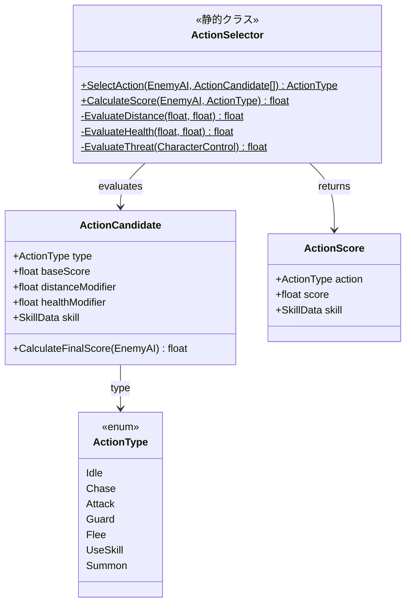
```mermaid
classDiagram
    class ActionSelector {
        <<静的クラス>>
        +SelectAction(EnemyAI, ActionCandidate[])$ ActionType
        +CalculateScore(EnemyAI, ActionType)$ float
        -EvaluateDistance(float, float)$ float
        -EvaluateHealth(float, float)$ float
        -EvaluateThreat(CharacterControl)$ float
    }

    class ActionCandidate {
        +ActionType type
        +float baseScore
        +float distanceModifier
        +float healthModifier
        +SkillData skill
        +CalculateFinalScore(EnemyAI) float
    }

    class ActionType {
        <<enum>>
        Idle
        Chase
        Attack
        Guard
        Flee
        UseSkill
        Summon
    }

    class ActionScore {
        +ActionType action
        +float score
        +SkillData skill
    }

    ActionSelector --> ActionCandidate : evaluates
    ActionSelector --> ActionScore : returns
    ActionCandidate --> ActionType : type
```

### 9.3 グループAI

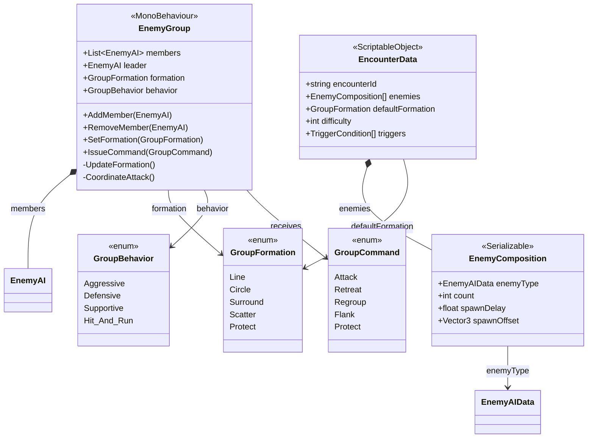
```mermaid
classDiagram
    class EnemyGroup {
        <<MonoBehaviour>>
        +List~EnemyAI~ members
        +EnemyAI leader
        +GroupFormation formation
        +GroupBehavior behavior

        +AddMember(EnemyAI)
        +RemoveMember(EnemyAI)
        +SetFormation(GroupFormation)
        +IssueCommand(GroupCommand)
        -UpdateFormation()
        -CoordinateAttack()
    }

    class GroupFormation {
        <<enum>>
        Line
        Circle
        Surround
        Scatter
        Protect
    }

    class GroupBehavior {
        <<enum>>
        Aggressive
        Defensive
        Supportive
        Hit_And_Run
    }

    class GroupCommand {
        <<enum>>
        Attack
        Retreat
        Regroup
        Flank
        Protect
    }

    class EncounterData {
        <<ScriptableObject>>
        +string encounterId
        +EnemyComposition[] enemies
        +GroupFormation defaultFormation
        +int difficulty
        +TriggerCondition[] triggers
    }

    class EnemyComposition {
        <<Serializable>>
        +EnemyAIData enemyType
        +int count
        +float spawnDelay
        +Vector3 spawnOffset
    }

    EnemyGroup *-- EnemyAI : members
    EnemyGroup --> GroupFormation : formation
    EnemyGroup --> GroupBehavior : behavior
    EnemyGroup --> GroupCommand : receives
    EncounterData *-- EnemyComposition : enemies
    EncounterData --> GroupFormation : defaultFormation
    EnemyComposition --> EnemyAIData : enemyType
```

### 9.4 ボスAIシステム

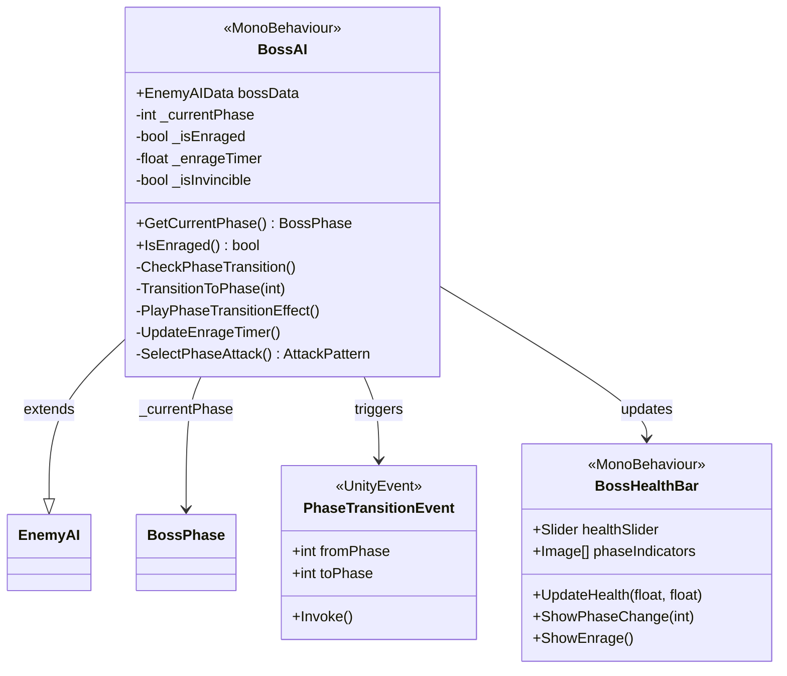
```mermaid
classDiagram
    class BossAI {
        <<MonoBehaviour>>
        +EnemyAIData bossData
        -int _currentPhase
        -bool _isEnraged
        -float _enrageTimer
        -bool _isInvincible

        +GetCurrentPhase() BossPhase
        +IsEnraged() bool
        -CheckPhaseTransition()
        -TransitionToPhase(int)
        -PlayPhaseTransitionEffect()
        -UpdateEnrageTimer()
        -SelectPhaseAttack() AttackPattern
    }

    class PhaseTransitionEvent {
        <<UnityEvent>>
        +int fromPhase
        +int toPhase
        +Invoke()
    }

    class BossHealthBar {
        <<MonoBehaviour>>
        +Slider healthSlider
        +Image[] phaseIndicators
        +UpdateHealth(float, float)
        +ShowPhaseChange(int)
        +ShowEnrage()
    }

    BossAI --|> EnemyAI : extends
    BossAI --> BossPhase : _currentPhase
    BossAI --> PhaseTransitionEvent : triggers
    BossAI --> BossHealthBar : updates
```

---

## 10. クエストシステム層

### 10.1 クエストデータ構造

```mermaid
classDiagram
    class QuestData {
        <<ScriptableObject>>
        +string questId
        +string questName
        +QuestType questType
        +int chapter
        +string description
        +QuestObjective[] objectives
        +string[] prerequisites
        +QuestReward rewards
        +bool isRepeatable
        +IsAvailable(QuestProgress) bool
        +IsComplete(QuestProgress) bool
    }

    class QuestType {
        <<enum>>
        Main
        Sub
    }

    class QuestObjective {
        <<Serializable>>
        +ObjectiveType type
        +string targetId
        +int requiredAmount
        +string description
    }

    class ObjectiveType {
        <<enum>>
        Defeat
        Collect
        Reach
        Escort
        TimeAttack
        Talk
        Investigate
        Combined
    }

    class QuestReward {
        <<Serializable>>
        +int exp
        +int gold
        +ItemReward[] items
        +int skillPoints
        +bool isSelectable
        +SelectableReward[] selectableRewards
    }

    class ItemReward {
        <<Serializable>>
        +ItemData item
        +int amount
    }

    class SelectableReward {
        <<Serializable>>
        +string label
        +QuestReward reward
    }

    QuestData --> QuestType : questType
    QuestData *-- QuestObjective : objectives
    QuestData *-- QuestReward : rewards
    QuestObjective --> ObjectiveType : type
    QuestReward *-- ItemReward : items
    QuestReward *-- SelectableReward : selectableRewards
```

### 10.2 クエスト管理システム

```mermaid
classDiagram
    class QuestManager {
        <<MonoBehaviour/Singleton>>
        -List~QuestProgress~ _activeQuests
        -List~string~ _completedQuestIds
        -Dictionary~string,QuestData~ _questDatabase

        +AcceptQuest(string questId) bool
        +AbandonQuest(string questId) bool
        +UpdateObjective(ObjectiveType, string targetId, int amount)
        +CompleteQuest(string questId, int rewardChoice)
        +GetActiveQuests() List~QuestProgress~
        +GetAvailableQuests() List~QuestData~
        +IsQuestComplete(string questId) bool
        +CanAcceptQuest(string questId) bool
    }

    class QuestProgress {
        +QuestData questData
        +ObjectiveProgress[] objectiveProgress
        +DateTime startTime
        +QuestStatus status

        +UpdateProgress(int objectiveIndex, int amount)
        +IsComplete() bool
        +GetProgress(int objectiveIndex) tuple
    }

    class ObjectiveProgress {
        +int currentAmount
        +bool isComplete
    }

    class QuestStatus {
        <<enum>>
        NotStarted
        InProgress
        ReadyToComplete
        Completed
        Failed
    }

    QuestManager *-- QuestProgress : _activeQuests
    QuestManager --> QuestData : _questDatabase
    QuestProgress --> QuestData : questData
    QuestProgress *-- ObjectiveProgress : objectiveProgress
    QuestProgress --> QuestStatus : status
```

---

## 11. パートナーシステム層

### 11.1 パートナーデータ構造

```mermaid
classDiagram
    class PartnerData {
        +int partnerId
        +string partnerName
        +int currentLevel
        +int originalLevel
        +StatusData baseStatus
        +StatusData currentStatus
        +bool isActive
        +PartnerSize size
        +PartnerBehavior behavior
        +Initialize(EnemyData)
        +LevelUp()
        +SetBehavior(PartnerBehavior)
    }

    class PartnerSize {
        <<enum>>
        Small
        Normal
    }

    class PartnerBehavior {
        <<enum>>
        Aggressive
        Defensive
        Support
        Passive
    }

    class PartnerManager {
        <<MonoBehaviour/Singleton>>
        -List~PartnerData~ _registeredPartners
        -List~PartnerData~ _activePartners
        -int _maxRegistration
        -int _maxActive

        +RegisterPartner(PartnerData) bool
        +ActivatePartner(int partnerId) bool
        +DeactivatePartner(int partnerId)
        +GetActivePartners() List~PartnerData~
        +MergePartner(PartnerData, PartnerData)
        +CanRegister() bool
        +GetSlotUsage() float
    }

    PartnerData --> PartnerSize : size
    PartnerData --> PartnerBehavior : behavior
    PartnerData --> StatusData : baseStatus
    PartnerManager *-- PartnerData : manages
```

### 11.2 パートナードロップシステム

```mermaid
classDiagram
    class PartnerDropCalculator {
        <<static>>
        +CalculateDropRate(float bossHP, float overkillDamage, float baseRate)$ float
        +GetOverkillMultiplier(float ratio)$ float
    }

    class PartnerAcquisitionChoice {
        <<enum>>
        MergeToExisting
        RegisterNew
    }

    class PartnerAcquisitionUI {
        +Show(PartnerData existing, PartnerData new)
        +OnChoiceMade(PartnerAcquisitionChoice)
    }

    PartnerDropCalculator --> PartnerData : creates
    PartnerAcquisitionUI --> PartnerAcquisitionChoice : uses
```

---

## 補足: 外部ライブラリ依存

| ライブラリ | 用途 |
|-----------|------|
| Databrain | データ管理、ScriptableObject拡張 |
| Databrain.Inventory | インベントリシステム |
| DOTween | アニメーション、Tween処理 |
| DamageNumbersPro | ダメージ数値表示 |
| Unity.Cinemachine | カメラ制御、インパルス |
| TextMeshPro | UIテキスト |

---

**作成日**: 2026-01-14
**更新日**: 2026-01-16
**バージョン**: 1.1