# PictureStory 状態遷移図

## 目次
1. [キャラクター状態遷移](#1-キャラクター状態遷移)
2. [戦闘状態遷移](#2-戦闘状態遷移)
3. [アイテムスキル発動フロー](#3-アイテムスキル発動フロー)
4. [ガードシステム状態](#4-ガードシステム状態)
5. [バフ/デバフ状態](#5-バフデバフ状態)
6. [ゲーム全体の状態遷移（設計案）](#6-ゲーム全体の状態遷移設計案)
7. [敵AI状態遷移](#7-敵ai状態遷移)
8. [クエスト状態遷移](#8-クエスト状態遷移)
9. [インベントリ状態遷移](#9-インベントリ状態遷移)

---

## 1. キャラクター状態遷移

### 1.1 メイン状態遷移図

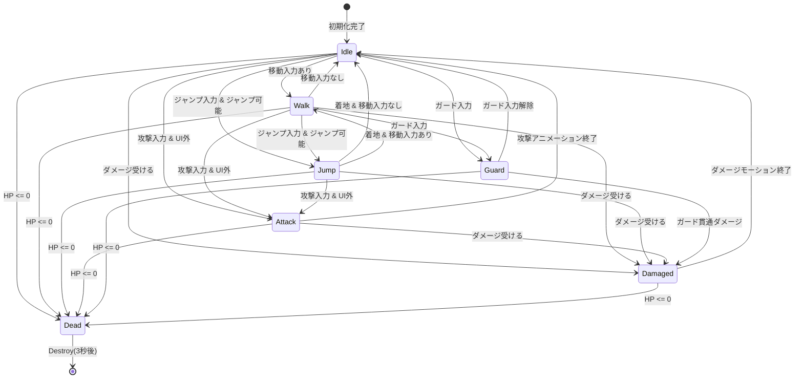

### 1.2 アニメーター状態（推定）

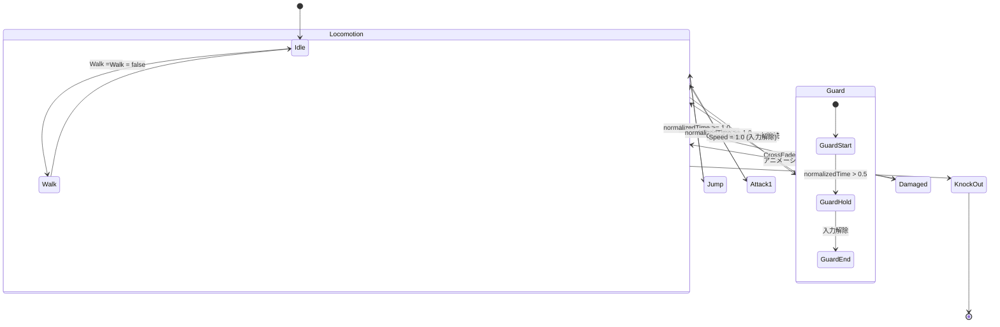

### 1.3 物理状態フラグ

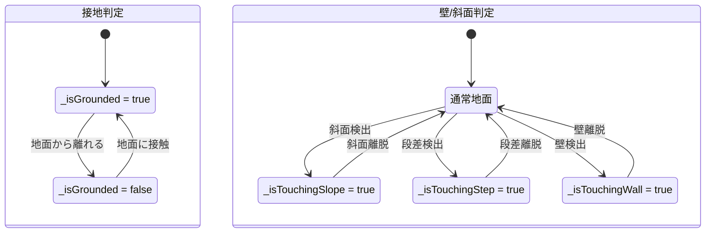

---

## 2. 戦闘状態遷移

### 2.1 ダメージ処理フロー

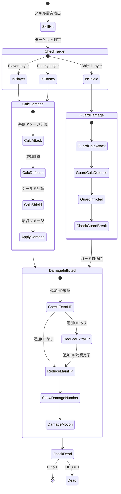

### 2.2 ダメージ計算詳細

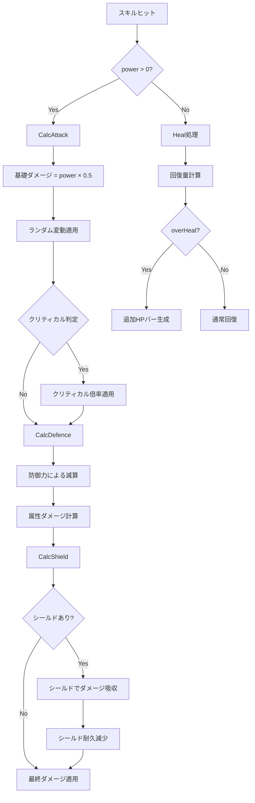

---

## 3. アイテムスキル発動フロー

### 3.1 アイテムスキル発動状態遷移

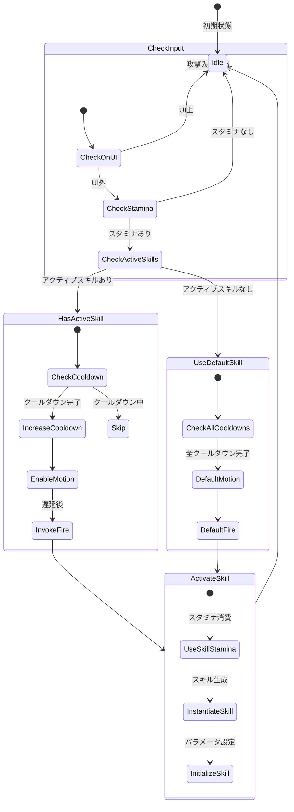

### 3.2 アイテムスキルアイコン状態

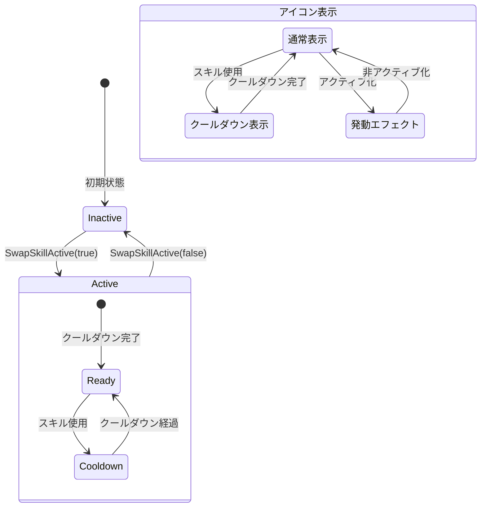

#### 3.2.1 クールダウン表示仕様

- **表示形式**: 円形ゲージ（Radial Fill）
- **動作**: 時計回りに減少（12時位置から開始）
- **完了演出**: ゲージ消滅時に軽いパルスエフェクト
- **色**: クールダウン中はグレーオーバーレイ、完了時は元の色に復帰

---

## 4. ガードシステム状態

### 4.1 ガード状態遷移

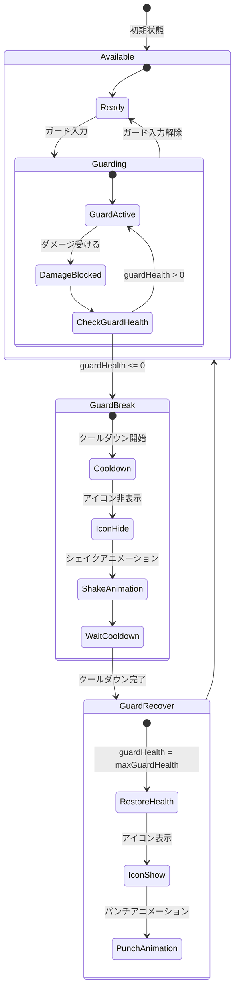

### 4.2 複数ガードの管理

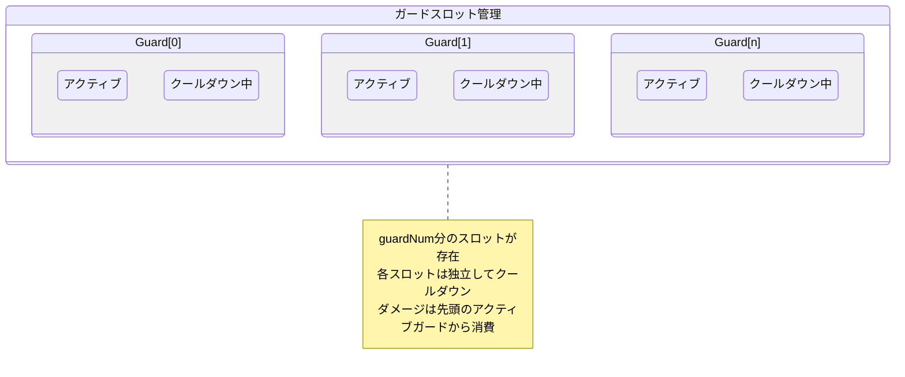

---

## 5. バフ/デバフ状態

### 5.1 バフライフサイクル

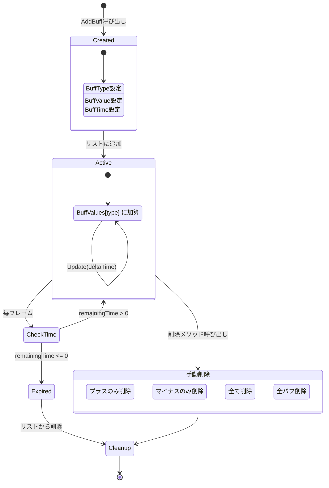

### 5.2 バフ効果の適用

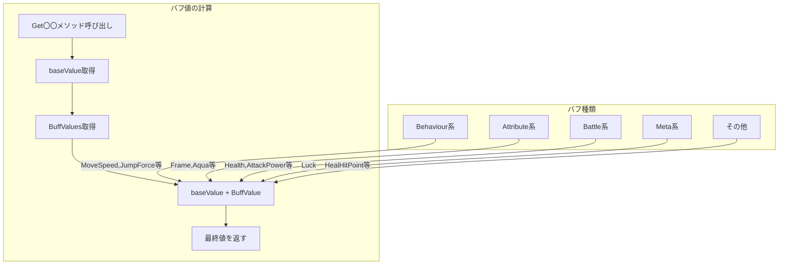

---

## 6. ゲーム全体の状態遷移（設計案）

### 6.1 シーン遷移（未実装部分含む）

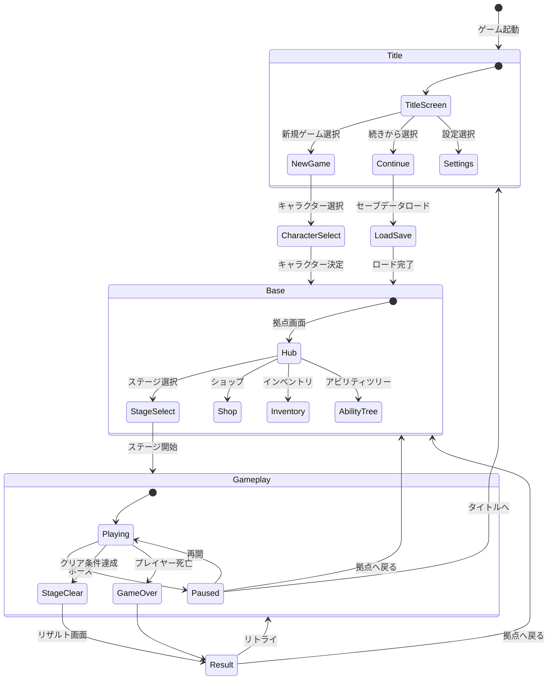

### 6.2 ゲームプレイ内の状態

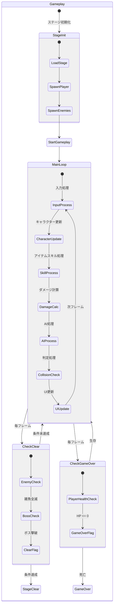

### 6.3 セーブ/ロードタイミング（設計案）

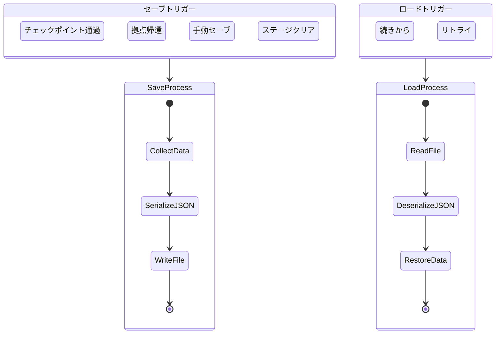

---

## 7. 敵AI状態遷移

### 7.1 基本AI状態遷移

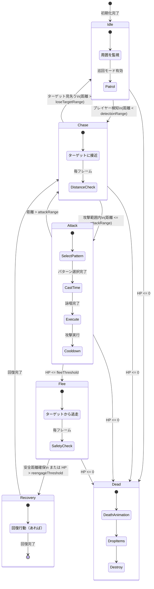

### 7.2 AI種類別の行動パターン

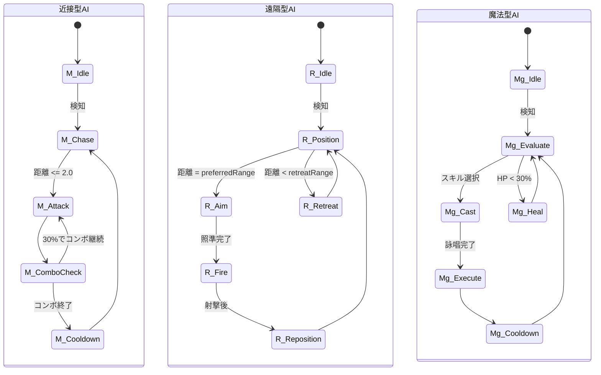

### 7.3 ボスAIフェーズ遷移

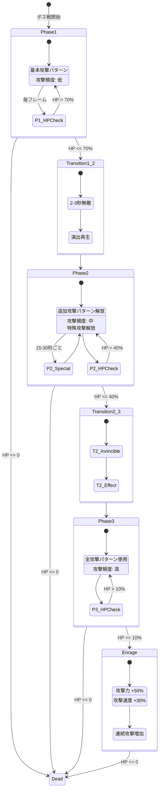

### 7.4 グループAI状態

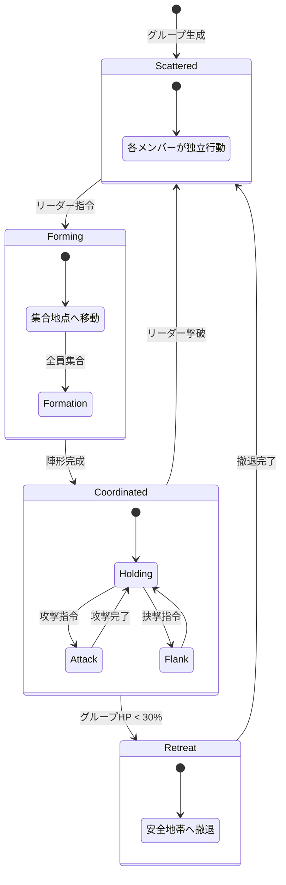

---

## 8. クエスト状態遷移

### 8.1 クエストライフサイクル

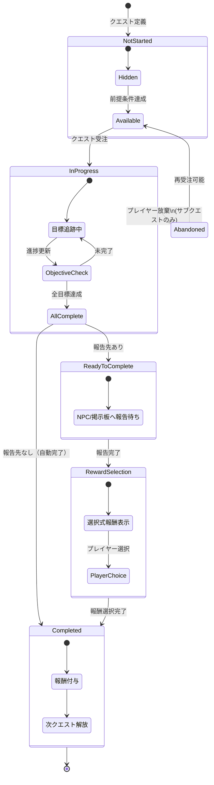

### 8.2 クエスト目標の状態

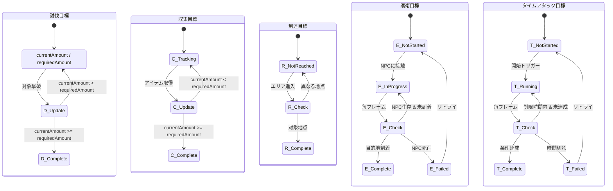

### 8.3 クエストUI状態

```mermaid
stateDiagram-v2
    [*] --> QuestLogClosed

    QuestLogClosed --> QuestLogOpen : メニュー開く

    state QuestLogOpen {
        [*] --> TabSelection
        TabSelection --> ActiveQuests : 進行中タブ
        TabSelection --> AvailableQuests : 受注可能タブ
        TabSelection --> CompletedQuests : 完了タブ

        state ActiveQuests {
            [*] --> QuestList
            QuestList --> QuestDetail : クエスト選択
            QuestDetail --> QuestList : 戻る
            QuestDetail --> AbandonConfirm : 放棄ボタン
            AbandonConfirm --> QuestList : 放棄確定
        }

        state AvailableQuests {
            [*] --> AvailableList
            AvailableList --> AcceptConfirm : クエスト選択
            AcceptConfirm --> AvailableList : 受注確定
        }
    }

    QuestLogOpen --> QuestLogClosed : メニュー閉じる
```

---

## 9. インベントリ状態遷移

### 9.1 インベントリシステム状態

```mermaid
stateDiagram-v2
    [*] --> Closed : 初期状態

    Closed --> Open : インベントリ開く

    state Open {
        [*] --> Browse
        Browse : スロット閲覧

        Browse --> ItemSelected : アイテム選択

        state ItemSelected {
            [*] --> ShowDetail
            ShowDetail : アイテム詳細表示
            ShowDetail --> ActionMenu : アクション表示
        }

        state ActionMenu {
            Use : 使用
            Equip : 装備
            Drop : 捨てる
            Split : 分割
        }

        ActionMenu --> UseItem : 使用選択
        ActionMenu --> EquipItem : 装備選択
        ActionMenu --> DropItem : 捨てる選択
        ActionMenu --> SplitItem : 分割選択

        UseItem --> Browse : 使用完了
        EquipItem --> Browse : 装備完了
        DropItem --> DropConfirm : 確認
        DropConfirm --> Browse : 確定
        SplitItem --> SplitUI : 分割UI
        SplitUI --> Browse : 分割完了

        ItemSelected --> Browse : キャンセル
    }

    Open --> Closed : インベントリ閉じる
```

### 9.2 アイテム追加フロー

```mermaid
stateDiagram-v2
    [*] --> ItemAcquired : アイテム取得

    ItemAcquired --> CheckStack : スタック確認

    state CheckStack {
        [*] --> FindExisting
        FindExisting --> HasExisting : 同アイテムあり
        FindExisting --> NoExisting : 同アイテムなし
    }

    HasExisting --> CheckStackLimit

    state CheckStackLimit {
        [*] --> CanStack : スタック可能
        CanStack --> AddToStack : スタックに追加
        [*] --> StackFull : スタック上限
        StackFull --> FindEmptySlot
    }

    NoExisting --> FindEmptySlot

    state FindEmptySlot {
        [*] --> MainInventory
        MainInventory --> HasEmpty : 空きあり
        MainInventory --> NoEmpty : 空きなし
        NoEmpty --> CheckBag : バッグ確認
        CheckBag --> BagHasEmpty : バッグに空きあり
        CheckBag --> InventoryFull : 完全に満杯
    }

    HasEmpty --> AddToEmpty : 空きスロットに追加
    BagHasEmpty --> AddToBag : バッグに追加

    AddToStack --> UpdateUI
    AddToEmpty --> UpdateUI
    AddToBag --> UpdateUI

    state UpdateUI {
        [*] --> RefreshSlots
        RefreshSlots --> RefreshIcons
        RefreshIcons --> ShowNotification
    }

    UpdateUI --> Success : 追加成功

    InventoryFull --> Overflow : 追加失敗

    state Overflow {
        [*] --> DropToGround : 地面に落とす
        DropToGround --> ShowWarning : 警告表示
    }

    Success --> [*]
    Overflow --> [*]
```

### 9.3 装備変更フロー

```mermaid
stateDiagram-v2
    [*] --> EquipRequest : 装備リクエスト

    EquipRequest --> CheckRequirements

    state CheckRequirements {
        [*] --> CheckLevel : レベル確認
        CheckLevel --> LevelOK : 条件クリア
        CheckLevel --> LevelNG : レベル不足
        LevelOK --> CheckSlot : スロット確認
    }

    LevelNG --> EquipFailed : 装備失敗

    state CheckSlot {
        [*] --> SlotEmpty : スロット空き
        [*] --> SlotOccupied : 装備中アイテムあり
    }

    SlotEmpty --> DirectEquip

    SlotOccupied --> SwapEquipment

    state SwapEquipment {
        [*] --> UnequipCurrent
        UnequipCurrent --> MoveToInventory
        MoveToInventory --> EquipNew
    }

    DirectEquip --> ApplyStats
    SwapEquipment --> ApplyStats

    state ApplyStats {
        [*] --> UpdateCharacterStats
        UpdateCharacterStats --> UpdateSkillCache
        UpdateSkillCache --> RefreshUI
    }

    ApplyStats --> EquipSuccess

    EquipSuccess --> [*]
    EquipFailed --> [*]
```

### 9.4 アイテムスキルスロット状態

```mermaid
stateDiagram-v2
    state "アイテムスキルスロット[0-9]" as SkillSlots {
        state "各スロット状態" as SlotState {
            [*] --> Empty : 初期状態

            Empty --> Equipped : アイテムスキルアイテム装備

            state Equipped {
                [*] --> Ready : クールダウンなし
                Ready --> Active : アクティブ化
                Active --> Casting : アイテムスキル発動
                Casting --> Cooldown : 発動完了
                Cooldown --> Ready : クールダウン完了
                Active --> Ready : 非アクティブ化
            }

            Equipped --> Empty : アイテム外す

            state "耐久度管理" as Durability {
                [*] --> Full
                Full --> Damaged : 使用で消耗
                Damaged --> Damaged : 継続使用
                Damaged --> Broken : 耐久度 = 0
                Broken --> Repaired : 修理
                Repaired --> Full
            }
        }
    }

    note right of SkillSlots
        10個のスロット（inventorySlots[10]）
        各スロットは独立して状態管理
        UI表示は4スロットまで
    end note
```

---

## 補足: CharacterControlの内部状態フラグ一覧

| フラグ名 | 型 | 説明 | 初期値 |
|---------|-----|------|--------|
| _isGrounded | bool | 接地判定 | false |
| _isTouchingSlope | bool | 斜面接触 | false |
| _isTouchingStep | bool | 段差接触 | false |
| _isTouchingWall | bool | 壁接触 | false |
| _isJumping | bool | ジャンプ中 | false |
| _isCrouch | bool | しゃがみ/ガード中 | false |
| _isDead | bool | 死亡状態 | false |
| _isOnUI | bool | UI操作中 | false |
| _jump | bool | ジャンプ入力 | false |
| _jumpHold | bool | ジャンプ長押し | false |
| _attack | bool | 攻撃入力 | false |
| _guard | bool | ガード入力 | false |
| _sprint | bool | ダッシュ入力 | false |
| _modeChange | bool | モード変更入力 | false |

---

**作成日**: 2026-01-14
**バージョン**: 1.0
